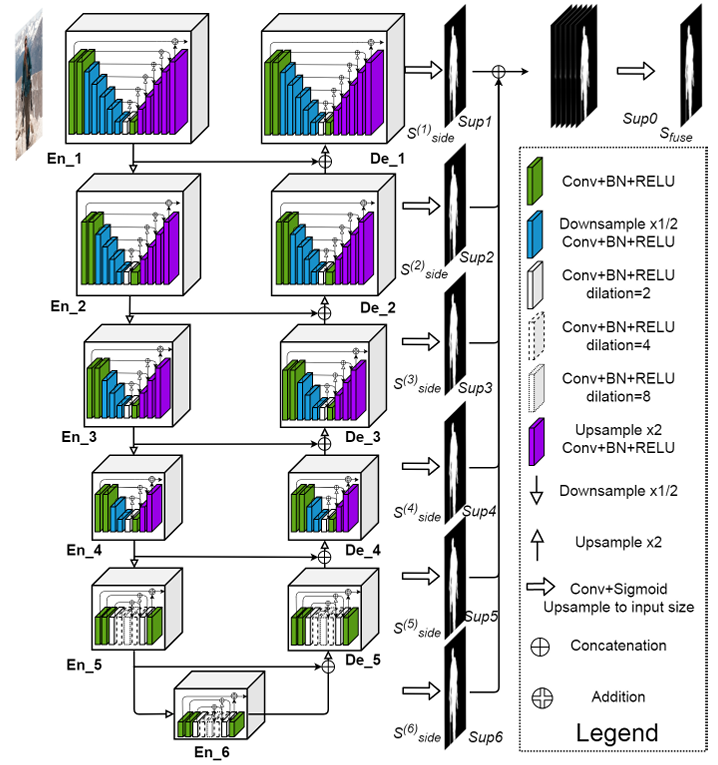
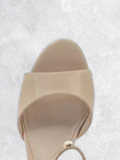
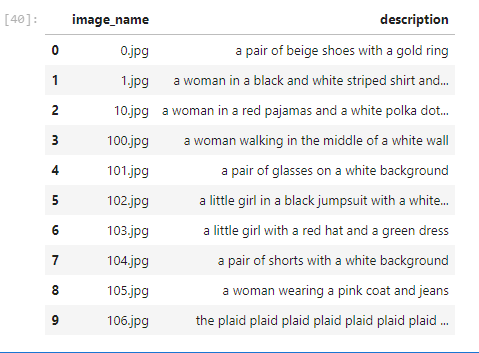

# Кейс по CV смена по ML в Сириусе 24

## Задача
Было дано 3 задачи: 

1. Удаление фона
2. Замена фона на текстуру
3. Генерация описания по фотографии

### Удаление фона
Для удаления фона существует множество различных подходов с использованием DL или с использованием методов OpenCV.

Первые 2 теста, я делал с помощью OpenCV
#### Тест 1
Самый простой способ отделить фон от фото - маскировать по цветам. 
Результат: 

Плюсы: работает очень быстро, не требует обучения и сложных вычислительных ресурсов

Минусы: под каждый фон, надо подбирать нижние и верхние границы, плохо работает с не контрастными фото

#### Тест 2
Далее, я нашел статью, где разбирается 3 разных способа отделения объекта от фона

Результат: 

Результат:

В данном методе мы уже работали с пространством HSV, что должно было лучше помогло выделять маски, но к сожалению не получилось

Результат:

 

#### Тест 3
Самый удачный тест, с использованием предобученной модели U2Net на выделении объекта и удалении его с фона

Архитектура модели:

Результат: 

### Замена фона

Для замены фона, я нашел в интернете картинку с подходящей текстурой и использовал библиотеку Pillow для вставки текстуры в изображение, которое я получаю на выходе модели u2net

### Генерация описания 

Для генерации описания, я использовал модель blip-base.

К сожалению, получилось реализовать только в кривом формате, так как модели, которые были предобучены на генерацию описания одежды были в неправильном формате загружены на hugging face.

Можно улучшить описание с помощью LLM, добавив промт "Переведи на русский язык, измени текст как для описания товара для маркетплейса"
