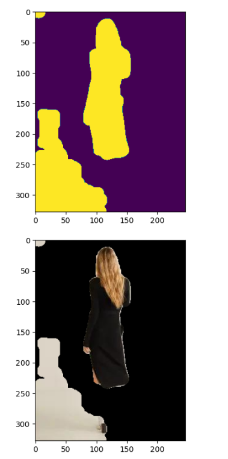
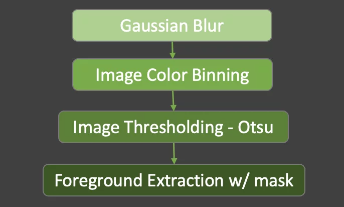
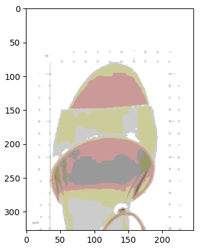
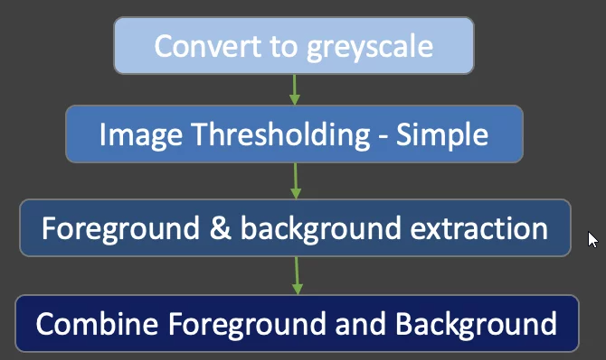
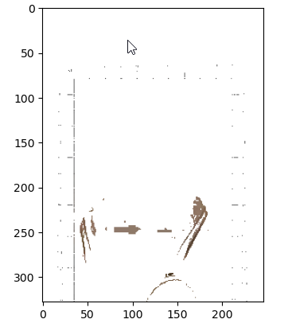
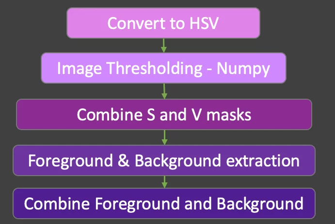
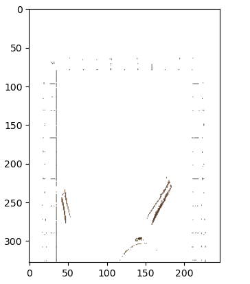

# Кейс по CV смена по ML в Сириусе 24

## Задача
Было дано 3 задачи: 

1. Удаление фона
2. Замена фона на текстуру
3. Генерация описания по фотографии

### Удаление фона
Для удаления фона существует множество различных подходов с использованием DL или с использованием методов OpenCV.

Первые 2 теста, я делал с помощью OpenCV
#### Тест 1
Самый простой способ отделить фон от фото - маскировать по цветам. 
Результат: 

Плюсы: работает очень быстро, не требует обучения и сложных вычислительных ресурсов

Минусы: под каждый фон, надо подбирать нижние и верхние границы, плохо работает с не контрастными фото

#### Тест 2
Далее, я нашел статью, где разбирается 3 разных способа отделения объекта от фона

Результат: 

Результат:

В данном методе мы уже работали с пространством HSV, что должно было лучше помогло выделять маски, но к сожалению не получилось

Результат: 

#### Тест 3
Самый удачный тест, с использованием предобученной модели U2Net на выделении объекта и удалении его с фона
